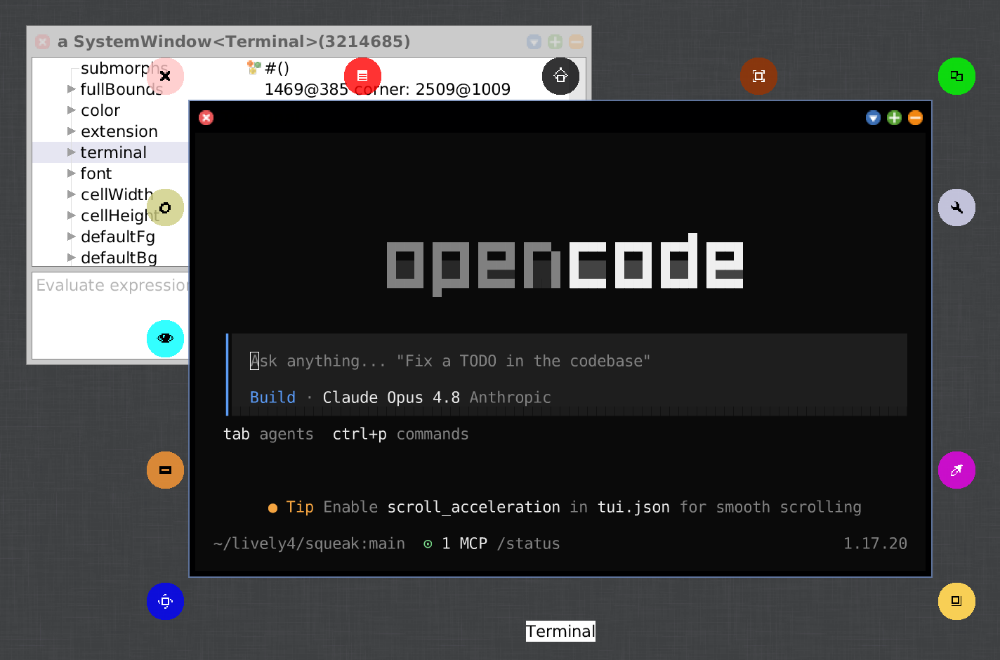

# Squeak Terminal

Squeak Terminal is a interactive **VT100 / VT102 / xterm** terminal emulator
for [Squeak](https://squeak.org). It can run a shell bash and modern terminal programs like opencode in a Morphic window.

It it implemented with [**libvterm**](https://github.com/neovim/libvterm) via **FFI**. 
It does the heavy lifting and parses the escape sequences and maintains the screen
grid. Squeak feeds it bytes from a pseudo-terminal and reads back the cell grid to
draw it; the shell is spawned with libc's `forkpty`. 

Squeak Terminal runs on Linux.



## Features

- Run a **real interactive shell** over a pseudo-terminal
- Full VT100/VT102 + xterm emulation: cursor movement, scroll regions,
  insert/delete, **SGR colours** (16 and 256-colour palette), bold, underline,
  reverse
- **UTF-8** including box-drawing, block, shade, and arrow glyphs
- **Select, copy and paste**
- **Resizable**:

## Installation

1. Make sure `libvterm.so` is next to your image
2. It also bind your C library exports `forkpty`/`openpty`  from glibc
3. Install Squeak Terminal via Metacello

```smalltalk
Metacello new
    baseline: 'SqueakTerminal';
    repository: 'github://hpi-swa-lab/squeak-terminal:main/src';
    load.
```

To develop this package, use GitS.

## Usage

The main class is `SWATermMorph`. The quickest way in:

```smalltalk
SWATermMorph open.   "opens a terminal running bash in a window"
```

Or wire it up yourself:

```smalltalk
m := SWATermMorph new.
m openInWindow.
m startShell.
```

Run something other than bash:

```smalltalk
m startCommand: '/usr/bin/htop' args: #().
```

## Authors

* Jens Lincke, Software-Architecture Group, HPI, 2026

## AI Usage

* Created with the help of [SqueakMCP](https://github.com/hpi-swa-lab/squeak-mcp) / OpenCode / Claude Opus

## License

MIT -- see [LICENSE](LICENSE). The bundled `libvterm.so` is MIT-licensed
([neovim/libvterm](https://github.com/neovim/libvterm)); the bundled DejaVu Sans
Mono font is under its own permissive license.
